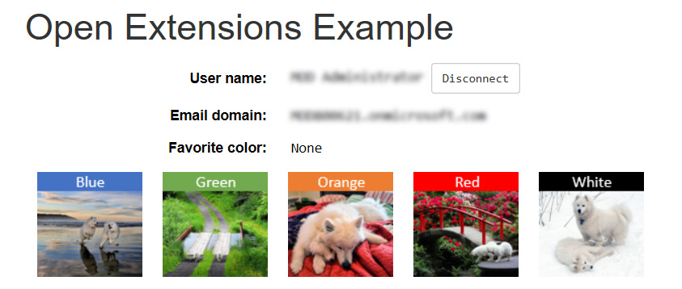

# graph-open-extension

Single-page Python/Bottle web app demonstrating how to use the [openTypeExtension](https://developer.microsoft.com/en-us/graph/docs/api-reference/beta/resources/opentypeextension) feature of Microsoft Graph to store user preferences. The *color* setting is saved in an open extension attached to the current user's node in Graph.

Start the server by running the extensibility.py program, then point a browser at [http://localhost:5000](http://localhost:5000). Click the Connect button to log in, and then you'll see a page with clickable tiles where you can select a favorite color:



When you click on a tile, the color setting is updated. Here's an example after clicking the white tile:


Here's an example after clicking the blue tile:


The setting is saved with the user's node in Graph, so it is persistent and can be made available whenever the user connects, from any device or application. In this sample, the user will default to their saved preference if they've run the app before and selected a color.

## installation/configuration

To set up the environment to run this sample:

* install Python 3.x ([latest version](https://www.python.org/))
* ```pip install requests-oauthlib``` (OAuth2 library used for authentication)
* ```pip install bottle``` (simple framework for web app)

To configure the sample:

* Register an app at either the [Application Registration Portal](https://apps.dev.microsoft.com) or the [Azure Portal](https://ms.portal.azure.com), and give it User.Read and Directory.AccessAsUser.All permissions.
* Note that you'll need to either be an admin in your org or have an admin give your app consent for the Directory.AccessAsUser scope.
* Create an ```auth_settings.txt``` file in the root folder of the sample, with your App ID on the first line and your App Secret on the second line.

After those steps are complete, run extensibility.py and navigate your browser to localhost:5000 to run the sample.
